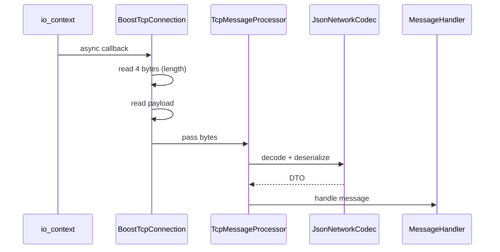
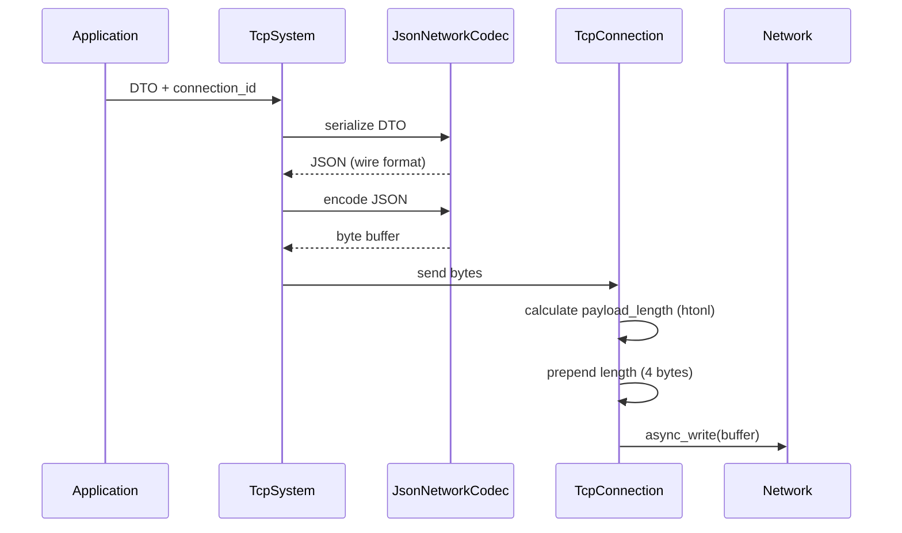

# chatcore | Multi-Threaded Chat System in C++23

[](https://github.com/PIXCLDEV/ChatCore/actions/workflows/ci.yml)

`chatcore` is an educational networking/multi-threading project built in C++23. The codebase provides the core architecture for:
- a TCP server with a custom protocol
- a client application which implements the custom protocol
- a load tester to evaluate the performance and correctness of the server under load

The project is built and tested on Linux and Windows in CI, compiles with strict warning flags, and includes unit tests (gtest).

## Demo


### Docker Quick-Start
The source code can be built and run using docker, including a `demo.sh` script to start two clients, the server and the load tester in a tmux session.
#### Linux

```bash
sudo -E docker build -t chatcore-demo -f scripts/docker/Dockerfile.linux "git@github.com:ebroschin/chatcore.git#master" \
&& sudo docker run --rm -it -p 1338:1338 chatcore-demo bash -lc '/workspace/src/scripts/docker/demo.sh' 
```

#### Windows
TBD docker instruction

### Manual Build (Linux)
Manual build instructions are currently provided for Linux only.
Windows compatibility is validated in CI and via Visual Studio builds with MSVC.

#### Install required dependencies

```bash
apt-get update
apt-get install -y \
  wget curl gnupg lsb-release ca-certificates git unzip zip \
  build-essential pkg-config \
  autoconf automake libtool m4 gawk gettext texinfo tmux \
  software-properties-common
wget https://apt.llvm.org/llvm.sh
chmod +x llvm.sh
./llvm.sh 20
apt-get install -y clang-20 clang++-20 ninja-build cmake clang-tidy-20
```

#### Clone and Build

```bash
git clone --recurse-submodules https://github.com/ebroschin/chatcore.git
cd chatcore
./scripts/linux/build-all.sh
```

#### Run Demo (tmux session)
```bash
./scripts/docker/demo.sh .
```

#### Run individual applications

```bash
./build/linux-release-server/apps/server/chatcore-server --ip 0.0.0.0 --port 1338 --db sqlite.db --log info
./build/linux-release-client/apps/client/chatcore-client --ip localhost --port 1338 --log info
./build/linux-release-load-tester/apps/load-tester/chatcore-load-tester --ip localhost --port 1338 --clients 100 --log info
```

## Features

The system allows a user to:
- Create users and authenticate with username and password to establish a session
- Create chat channels
- Join chat channels and receive the latest chat messages
- Receive/Write chat messages to all users in a channel
- Use the bundled FTXUI terminal client to interact with the chat server
- Use the bundled Load Tester to evaluate latency percentiles (p50, p95, p99, max) by spawning a configurable amount of clients with a steady stream of chat messages

The server supports:
- Persistent data throughout server restarts (using sqlite for simplicity)
- Concurrent client connections

The feature scope of the project is intentionally constrained with known [limitations](#Limitations).

## Project Structure

The source code of the repository is structured into `apps` (executables) and `libs` (modules) folders. 
Third party dependencies are managed via Microsoft's package manager tool **vcpkg**, which is included to the repository as a submodule. The repository uses the following third party dependencies:

`boost-stacktrace, boost-asio, boost-bimap, boost-multi-index, nlohmann-json, sqlitecpp, spdlog, gtest`

### Applications/Executables

| Path                                             | Purpose                                                                                                                               |  
| ------------------------------------------------ | ------------------------------------------------------------------------------------------------------------------------------------- |  
| [`apps/server`](apps/server)           | TCP chat server, binds to an IP address, handles incoming network messages and manages connections, users, chat channels and messages |  
| [`apps/client`](apps/client)           | FTXUI terminal client, allowing users to receive and send network messages to the chat server via commands                            |  
| [`apps/load-tester`](apps/load-tester) | CLI tool, spawns test clients to simulate high traffic and creates a latency/error report (p50, p95, p99, max)                        |  

### Internal Libraries

The bundled library modules are extracted from my personal codebase and are intentionally reduced to include only code which is used by this repository.

| Path                                 | Purpose                                                                                                                             |  
| ------------------------------------ | ----------------------------------------------------------------------------------------------------------------------------------- |  
| `libs/chatcore-api`                  | Shared protocol message DTO's and RPC call definitions                                                                              |  
| `libs/ebroschin-core`                | Application lifecycle and dependency context                                                                                        |  
| `libs/ebroschin-network`             | Transport-agnostic TCP/RPC abstractions                                                                                             |  
| `libs/ebroschin-network-modules`     | Concrete implementations for `ebroschin-network`:  <br>> `boost-asio` connections, acceptor and resolver<br>> `nlohmann-json` message codec |  
| `libs/ebroschin-scheduling`          | Task/Job scheduler running on a dedicated thread                                                                                    |  
| `libs/ebroschin-persistence`         | Database/Storage-agnostic persistence abstractions                                                                                  |  
| `libs/ebroschin-persistence-modules` | Concrete implementations for `ebroschin-persistence`:<br>> `sqlitecpp` database                                                     |  
| `libs/ebroschin-commands`            | Compile-time command registry and dispatcher                                                                                        |  
| `libs/ebroschin-utility`             | Reusable utility for helpers, static functions and template code                                                                    |  
| `libs/ebroschin-logging`             | Technology-agnostic abstraction for a global logger with runtime-replaceable logger backends                                        |  
| `libs/ebroschin-logging-modules`     | Concrete implementations for `ebroschin-logging` :<br>> `spdlog` logger                                                             |  

## Threading/Concurrency Model

Each application uses the same threading model and thread-affine systems.

- **Main Thread**: bootstraps the application and its systems, some of which may spawn their own dedicated thread
  - Afterwards, the main thread sleeps until it receives a signal to quit the application, which in turn runs the shutdown routine, tearing down its systems and exiting the application process safely
- **Network I/O Thread**: spawned and owned by `TcpSystem` from `ebroschin-network` using either `BoostTcpResolver` (client) or `BoostTcpAcceptor` (server) from `ebroschin-network-modules`
  - These "connector" modules are implemented using `boost-asio`'s `io_context` and asynchronously create connection instances
  - Once a `TcpConnection` is created and registered to the `TcpSystem`, it can send and receive unstructured bytes
  - The concrete implementation of said `TcpConnection` (`BoostTcpConnection`) effectively defines the network protocol by interpreting these bytes
- **Application Thread**: spawned and owned by `ApplicationSystem`
  - Runs the message processor of the `TcpSystem` in a dedicated domain/business logic thread
  - The `MessageProcessor` acts as a thread-serialization boundary, it receives incoming network messages from `TcpConnection` instances and stores them in an internal queue
- **Scheduler Thread**: spawned and owned by `SchedulingSystem`
  - Accepts callbacks which can be executed after a certain amount of time or in intervals
  - The application developer must ensure that the scheduled callbacks access data in a thread-safe manner

## Networking Details

The transport protocol and wire format are defined by the application-specific modules that are instantiated with the `TcpSystem`.

- **Transport framing**: First 4 bytes represent the payload length (big-endian `uint32_t`, uses `htonl(), ntohl()`), while remaining bytes represent the payload
- **Wire format**: JSON (`nlohmann-json`)

`[apps/server] chat_tcp_system.hpp`
```cpp  
using ChatServerTcpSystem = network::tcp::TcpSystemBuilder<    
  network::modules::BoostTcpAcceptor, //uses boost-asio and defines how incoming/outgoing bytes from sockets are interpreted  
  network::modules::JsonNetworkCodec, //decodes/encodes bytes from/to json    
  network::modules::DirectMessageHandler, //defines how incoming network messages are handled    
  api::MessageTypes //compile-time registered list of message types
>::Type;  
```  
### Network Messages

The `TcpSystem` provides an abstraction for sending and receiving network messages as application-specific data transfer objects (DTO).

`[libs/chatcore-api] api.hpp`
```cpp  
struct ReceiveChatMessage {    
  static constexpr std::uint64_t TypeId = 103;    
    
  PersistenceId user_id;    
  PersistenceId channel_id;    
  std::string content;  
};    
    
struct WriteChatMessage {    
  static constexpr std::uint64_t TypeId = 104;    
    
  std::string content;  
};  
```  

In the provided implementation, the `BoostTcpConnection` starts reading bytes asynchronously after its instantiation via `boost::asio::async_read`.

When the system **receives** a network message:
1. The `io_context (boost-asio)` asynchronously calls back to `BoostTcpConnection`
2. The `BoostTcpConnection` reads the first 4 bytes (`sizeof(std::uint32_t)`) and interprets them as `std::uint32_t payload_length` via `ntohl()`
3. The `BoostTcpConnection` reads the next `payload_length` bytes and passes these to the `TcpMessageProcessor`
4. The `TcpMessageProcessor` uses the provided codec implementation (`JsonNetworkCodec`) to:
  5. Decode the bytes into the application-specific wire format (JSON)
  6. Deserialize the wire format into a C++ data transfer object (network message DTO)
7. The `TcpMessageProcessor` passes the DTO to the MessageHandler which calls the application-specific handler logic



When the system **sends** a network message:
1. The network message DTO is passed to the `TcpSystem` along with a `connection_id`
2. The TcpSystem uses the provided codec implementation (`JsonNetworkCodec`) to:
  3. Serialize the C++ data transfer object to the wire format (JSON)
  4. Encode the wire format to bytes
5. The `TcpConnection` that corresponds to the `connection_id` receives said bytes and:
  6. Calculates the `payload_length` as `std::uint32_t` via `htonl()`
  7. Prepends the `payload_length` (`sizeof(std::uint32_t) = 4`) to the payload bytes
  8. Sends the resulting bytes via `boost::asio::async_write`



### Message Handling

On the lowest level, the `TcpMessageProcessor` receives incoming network messages and calls the registered handlers based on its `TypeId`. On the highest level, the application defines which "actions" are performed by registering callbacks for each network message type.
#### Signals/Subscriptions

The client uses a 1:X message handling model. Each incoming network message triggers one or more callbacks in the application.

The client therefore uses the `ObservableMessageHandler` from `ebroschin-network-modules` which offers signals/subscription-based callback registration.
#### Direct Callbacks

The server uses a 1:1 message handling model. Each incoming network message has exactly one outcome:
- perform the necessary operations on the data
- return a response to sender

To facilitate higher throughput, the server therefore uses the much faster `DirectMessageHandler` from `ebroschin-network-modules` which offers only a single callback per network message type and avoids signals/subscriptions overhead.

## Software Design and Principles

The source code needs to compile with the provided compiler flags (root `CMakeLists.txt`) and pass static analysis using clang-tidy. During development, address sanitizers are enabled to detect memory access bugs and prevent undefined behavior.
### Principles

- strictly avoid using `new/delete` keywords in high-level application code, use smart pointers/RAII instead (`std::unique_ptr, std::shared_ptr`)
- raw pointer member variables are non-owning by definition
- use references for mandatory dependencies
- use `const` keyword on local variables to express immutability intent
- prefer using `auto` keyword, always explicitly define ownership/mutability qualifiers `(const, auto&, auto*)`
- when passing ownership to another function, pass the parameter by value and use `std::move()`
- use `std::shared_ptr` and `shared_from_this()` when passing objects that may outlive their scope to asynchronous callbacks in order to prevent use-after-free bugs
- use compile-time checks where applicable (`concept, require, if constexpr`)
- prefer static polymorphism using templates and C++20 concepts over runtime polymorphism via pure virtual interfaces where applicable

Output from a coding agent must be critically reviewed and refactored to maintain consistent code style, correctness and architectural ownership of the codebase.
### Core Patterns

Each application is structured using the same, recognizable pattern: a composition of sub-systems within a system context owned by the application (composition root). Each system implements a single responsibility of its applications specification, manages its own data and offers public functions to interface with other sub-systems.

`[apps/server] chat_server_application.cpp`
```cpp  
ctx_.Register<scheduling::SchedulingSystem>(); //runs & manages scheduling thread  
ctx_.Register<ChatServerTcpSystem>(); //runs & manages network thread  

auto* persistence_system = ctx_.Register<ChatPersistenceSystem>(arguments_.GetSqliteFilename()); //manages persistence adapters (business logic)  
persistence_system->Register<ChatPersistenceAdapter, SqliteChatPersistenceAdapter>(); //chat persistence functions  
persistence_system->Register<UserPersistenceAdapter, SqliteUserPersistenceAdapter>(); //user persistence functions  

ctx_.Register<ApplicationSystem>(*this); //runs & manages application thread  
ctx_.Register<UserServerSystem>(); //manages users, sessions and auth  
ctx_.Register<ChatServerSystem>(); //manages chat channels and chat messages  
```  

The order of system registration matters. Low-level systems are registered/initialized first, high-level systems are registered/initialized last. This ensures a clean dependency graph between systems without circular dependencies.

Each thread is managed by its own system (thread-affinity). The codebase uses modern STL tools for concurrency (`std::jthread std::scoped_lock ...`).

Each internal library implements an isolated system which can be reused in all kinds of applications using the `ebroschin-core` application pattern. An internal library is only allowed to have dependencies to other internal libraries and cannot depend on external third party code. An exception for this rule are "modules" libraries (for example `ebroschin-network-modules`) which offer concrete implementations that a developer can use or reference to implement their own classes.

## Benchmarks
Server Test Device Hardware:
- CPU: Intel(R) Core(TM) i7-6700K CPU @ 4.00GHz
- RAM: 31Gi
- OS: Linux Mint 22.3

Test Case:
- Create a configurable number of clients
- Each client joins the same test-channel
- Each client sends one message per second
  - the server broadcasts the message to all clients in the test-channel
  - when the sender receives its own message from the server, it marks said message as "Complete"
- Test runs for 10 seconds

| Clients | Sent | Failed | p50 (μs) | p95 (μs) | p99 (μs) | max (μs) |
| ------: | ---: | -----: | -------: | -------: | -------: | -------: |
|       5 |   45 |      0 |      279 |      334 |      351 |      369 |
|      25 |  225 |      0 |      356 |      553 |      582 |     2537 |
|     100 |  900 |      0 |      813 |     1424 |     2306 |    42439 |
|     200 | 1800 |      0 |     1376 |     2600 |    42209 |    43089 |
|     350 | 3150 |      0 |    65710 |   124434 |   130640 |   131121 |
|     450 | 4050 |   1603 |  1779904 |  3347632 |  3579313 |  3624184 |

Failed messages are those that could not complete a roundtrip before the end of the test duration.
The server handles a moderate load well. However, since the server does not implement a backpressure strategy, latency starts to rise as soon as the message queues begin to fill faster than the server can drain them.

## Limitations

The chat system should not be used in production as is. The following essential features were intentionally left out due to project scope:

- passwords are persisted in plain text (no hashing)
- network traffic is not encrypted (no TLS)
- no auth token/session renewal model
- no backpressure strategy for message queues
- no fairness strategy for incoming messages (payloads are processed sequentially in the order of arrival)
- no cache eviction strategy
- no session heartbeat (crashed clients stay logged in until server shutdown)
- the JSON wire format can be replaced with a binary format (for example protobuf) to improve performance and throughput of the chat server
- all chat messages that were sent 1 second before an unexpected server shutdown are lost (the server flushes to the database in intervals of 1 second)
- `std::pmr` data structures (preallocated memory) in hot paths would further improve chat server throughput
- running a load test with a high number of clients (e.g. 1000) will likely cause some authentication calls to time out (all clients attempt to log in at once, server message queues fill faster than they drain)